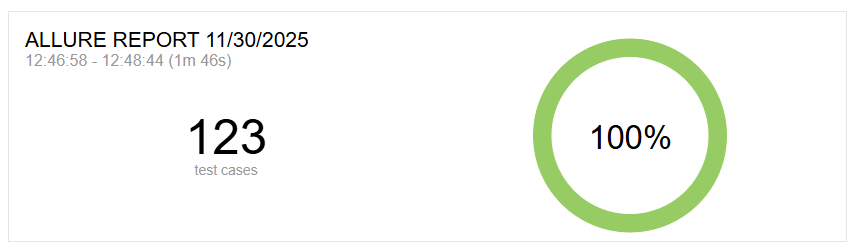
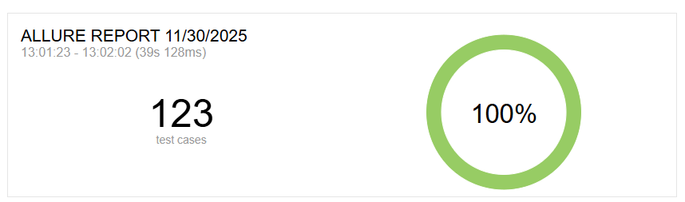

# cypress-allure-parallel

Run Cypress autotests in parallel for Allure report

# Cypress installation

1. Install Cypress: `npm install cypress`
2. Open Cypress: `npx cypress open`
3. Set up Cypress and add started pack with autotests (or use your own autotests)
4. Close Cypress

# Allure reports installation

1. Install Allure reports for Cypress: `npm install --save-dev allure-cypress`
2. Add settings for Allure reports to [`cypress.config.js`](./cypress.config.js)

```js
const { defineConfig } = require("cypress");

import { allureCypress } from "allure-cypress/reporter";

module.exports = defineConfig({
  e2e: {
    setupNodeEvents(on, config) {
      allureCypress(on, config, {
        resultsDir: "allure-results",
      });
      return config;
    },
  },
});
```

3. Add import to [`e2e.js`](./cypress/support/e2e.js) file:

```js
import "./commands";
import "allure-cypress";
```

# Add parallel running for Cypress autotests

1. Install [`concurrently`](http://npmjs.org/package/concurrently) package for running commands in parallel: `npm i concurrently`
2. Create a file which allows running Cypress autotests in parallel (1 thread = 1 Cypress run). It doesn't help you, if you want to run parallel specs in the same Cypress run.

```js
const fs = require("fs");
const exec = require("child_process").exec;

/**
 * Get all arguments with values from command line in 1 object
 * @returns command line arguments in object
 */
function getCommandLineArgs() {
  const args = {};
  let currentArgument;
  process.argv.forEach((argument) => {
    if (args.additional) {
      args.additional.push(argument);
    } else if (currentArgument) {
      args[currentArgument] = argument;
    }

    switch (argument) {
      // Directory with your autotests
      case "-d":
      case "-directory":
        currentArgument = "d";
        break;
      // Number of threads (depends on your processor)
      case "-t":
      case "-threads":
        currentArgument = "t";
        break;
      // Extension for Cypress spec files
      case "-ext":
        currentArgument = "ext";
        break;
      // Additional parameters for Cypress autotests
      case "--":
        currentArgument = "additional";
        args.additional = [];
        break;
      default:
        currentArgument = undefined;
    }
  });
  return args;
}

/**
 * Get all Cypress spec files
 * @param {string} directory directory where your cypress autotests are located
 * @param {string} ext extension for cypress autotests
 * @returns all Cypress spec files in array
 */
function getFiles(directory, ext = "cy.js") {
  try {
    const files = fs.readdirSync(`${directory}`, { recursive: true });
    const directoryPathForFiles = directory.replace("/", "\\");
    const cypressFiles = files
      .filter((f) => ~f.indexOf(ext))
      .map((f) => `.\\${directoryPathForFiles}\\${f}`);
    return cypressFiles;
  } catch (err) {
    console.error(err);
  }
}

/**
 * Divide files to chunks and return as array of arrays
 * @param {string[]} files array with Cypress spec files
 * @param {number} numOfThreads number of threads (depends on your processor)
 * @returns array of arrays with Cypress spec files
 */
function getChunks(files, numOfThreads) {
  const result = [];
  const chunkSize = Math.ceil(files.length / numOfThreads);
  for (let i = 0; i < files.length; i += chunkSize) {
    result.push(files.slice(i, i + chunkSize));
  }
  return result;
}

function main() {
  const args = getCommandLineArgs();
  const files = getFiles(args.d, args.ext);
  const numOfThreads = args.t;
  const chunks = getChunks(files, numOfThreads);
  const commands = [];
  chunks.forEach((chunk) => {
    commands.push(
      `"npx cypress run --spec ${chunk.join(",")} ${args.additional.join(" ")}"`
    );
  });
  const concurrentlyCommand = `npx concurrently ${commands.join(" ")}`;
  exec(concurrentlyCommand, (error, stdout, stderr) => {
    console.log(`stdout: ${stdout}`);
    console.log(`stderr: ${stderr}`);
    if (error !== null) {
      console.log(`exec error: ${error}`);
    }
  });
}

main();
```

3. Add scripts for different runs to [`package.json`](./package.json):

```json
{
  // ...
  "scripts": {
    "one-thread-run": "npx cypress run --browser chrome",
    "multi-threads-run": "node cypress-parallel.js -t 4 -d cypress/e2e -ext cy.js -- --browser chrome"
  }
  // ...
}
```

- `one-thread-run` allows to run all autotests as usual (in 1 thread)
- `multi-threads-run` allows to run all autotests using multiple threads (in this example - 4)

4. Run scripts: `npm run one-thread-run` or `npm run multi-threads-run`

# Difference between multiple threads and one thread

> You should have [`allure`](https://allurereport.org/docs/v2/install/) before running `allure generate` command.

When we run all Cypress autotests in 1 thread, it spends **`~1 minute 46 seconds`** and creates [`allure results`](./allure-results-1/). For creating allure report you can use `allure generate allure-results-1` command. Result: [`allure-report`](./allure-report-1/):



When we run all Cypress autotests in multiple threads, it spends **`~39 seconds`** and creates [`allure results`](./allure-results/). For creating allure report you can use `allure generate allure-results` command. Result: [`allure-report`](./allure-report)



You spend approximately 2 times less time, but get the same report.
